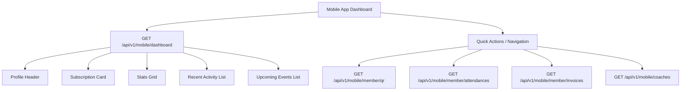

# Mobile Application API Contracts

This document contains the backend API contracts inferred from the mobile application user interface. 

---

## Screen 1: Member Dashboard (Home Screen)
Based on the dashboard user interface, we can infer the necessary data points, user interactions, and their mapping to the backend database schema.



### 1. Unified Dashboard Endpoint
To optimize performance and minimize HTTP requests on mobile startup, a single composite dashboard endpoint is recommended.

*   **Endpoint:** `GET /api/v1/mobile/dashboard`
*   **Authentication:** Required (Bearer Token / Sanctum)
*   **Headers:**
    ```http
    Accept: application/json
    Authorization: Bearer <token>
    Accept-Language: ar
    ```

#### Response Payload (`200 OK`):
```json
{
  "status": "success",
  "data": {
    "profile": {
      "first_name": "نايا",
      "full_name": "نايا الأسعد",
      "avatar_url": "https://api.clubsaas.com/storage/avatars/naya.jpg"
    },
    "subscription_card": {
      "status": "active",
      "status_label": "نشط",
      "plan_name": "باقة vip",
      "end_date": "2026-06-23",
      "formatted_end_date": "23/6/2026",
      "membership_number": "23455667",
      "price": 345.00,
      "formatted_price": "345$"
    },
    "stats": {
      "remaining_sessions": 60,
      "total_attendance": 34,
      "training_hours": 50,
      "last_payment": 543.00,
      "formatted_last_payment": "543$"
    },
    "recent_activities": [
      {
        "id": 102,
        "title": "جلسة تدريب القوة",
        "description": "اليوم : 8 صباحاً",
        "duration": 1.5,
        "duration_label": "1.5 ساعة",
        "created_at": "2026-06-10T08:00:00Z"
      },
      {
        "id": 101,
        "title": "جلسة تدريب القوة",
        "description": "اليوم : 8 صباحاً",
        "duration": 1.5,
        "duration_label": "1.5 ساعة",
        "created_at": "2026-06-10T08:00:00Z"
      }
    ],
    "upcoming_events": [
      {
        "id": 501,
        "title": "chest day",
        "exercises_count": 8,
        "duration_minutes": 45,
        "duration_label": "8 تمارين ، 45 دقيقة",
        "calories": 2300,
        "calories_label": "2300 سعرة",
        "image_url": "https://api.clubsaas.com/storage/workouts/chest-day-male.jpg"
      },
      {
        "id": 502,
        "title": "chest day",
        "exercises_count": 6,
        "duration_minutes": 45,
        "duration_label": "تمارين 45 دقيقة",
        "calories": 2300,
        "calories_label": "2300 سعرة",
        "image_url": "https://api.clubsaas.com/storage/workouts/chest-day-female.jpg"
      }
    ]
  }
}
```

---

### 2. Interaction & Navigation Endpoints

#### A. Member Access QR Code (Screen 7)
Used when the user taps on the "QR" quick action for gym check-in or navigates to the entry code screen.
*   **Endpoint:** `GET /api/v1/mobile/member/qr`
*   **Authentication:** Required
*   **Response Payload (`200 OK`):**
    ```json
    {
      "status": "success",
      "data": {
        "member_name": "نايا الأسعد",
        "plan_name": "اشتراك شهري vip",
        "avatar_url": "https://api.clubsaas.com/storage/avatars/naya.jpg",
        "qr_code_value": "MEMBER-23455667-TOKEN-XYZ987",
        "expires_in_seconds": 60,
        "remaining_sessions": 4,
        "is_inside_facility": true,
        "check_in_status_label": "نشط"
      }
    }
    ```
    > [!NOTE]
    > To prevent screenshot sharing, the `qr_code_value` should include a dynamic, short-lived token signature validated by the gate reader (`qr_access_logs`).
    > The field `is_inside_facility` indicates if the member is currently checked into the gym. When `true`, the UI displays the status "نشط" (representing that they are currently inside the facility).

#### B. Activities & Attendance Page (Screen 2)
Accessed when clicking "الحضور" (Attendance) in Quick Actions, or "قراءة المزيد" (Read More) next to "النشاطات الأخيرة" (Recent Activities).
This page includes a toggle filter for period (Weekly, Monthly, Yearly) and summary statistics.

*   **Endpoint:** `GET /api/v1/mobile/member/activities`
*   **Authentication:** Required
*   **Query Parameters:**
    *   `period` (optional): `weekly` | `monthly` | `yearly` (default: `weekly`)
    *   `page` (optional): integer (default: `1`)
    *   `limit` (optional): integer (default: `15`)

##### Response Payload (`200 OK`):
```json
{
  "status": "success",
  "data": {
    "stats": {
      "total_attendance": 43,
      "training_hours": 87.0,
      "training_hours_label": "87 س"
    },
    "items": [
      {
        "id": 1056,
        "title": "جلسة تدريب القوة",
        "date": "2026-06-02",
        "day": "02",
        "month": "يونيو",
        "time_label": "اليوم : 8 صباحاً",
        "duration_hours": 1.5,
        "duration_label": "1.5 ساعة"
      },
      {
        "id": 1055,
        "title": "جلسة تدريب القوة",
        "date": "2026-06-02",
        "day": "02",
        "month": "يونيو",
        "time_label": "اليوم : 8 صباحاً",
        "duration_hours": 1.5,
        "duration_label": "1.5 ساعة"
      }
    ],
    "pagination": {
      "total": 43,
      "per_page": 15,
      "current_page": 1,
      "last_page": 3
    }
  }
}
```
> [!TIP]
> The `period` parameter adjusts the `stats` (aggregating data only for the current week, month, or year) and filters the activity list accordingly. For example, if `period=weekly` is selected, `total_attendance` and `training_hours` show weekly aggregates, matching the "اسبوعي" tab in the UI.

#### C. Payments & Invoices (paginated)
Accessed when clicking "المدفوعات" in Quick Actions.
*   **Endpoint:** `GET /api/v1/mobile/member/invoices`
*   **Response Payload (`200 OK`):**
    ```json
    {
      "status": "success",
      "data": {
        "items": [
          {
            "invoice_id": 988,
            "amount": 543.00,
            "formatted_amount": "$543",
            "status": "paid",
            "payment_method": "cash",
            "paid_at": "2026-06-01"
          }
        ]
      }
    }
    ```

#### D. Trainers / Coaches List
Accessed when clicking "المدربين" in Quick Actions.
*   **Endpoint:** `GET /api/v1/mobile/coaches`
*   **Response Payload (`200 OK`):**
    ```json
    {
      "status": "success",
      "data": [
        {
          "id": 12,
          "name": "كابتن أحمد",
          "specialization": "تدريب كمال أجسام وقوة بدنية",
          "avatar_url": "https://api.clubsaas.com/storage/avatars/coach-ahmed.jpg"
        }
      ]
    }
    ```

#### E. Upcoming Workouts / Classes
Accessed when clicking "قراءة المزيد" next to "الفعاليات القادمة".
*   **Endpoint:** `GET /api/v1/mobile/sessions/upcoming`
*   **Response Payload (`200 OK`):**
    ```json
    {
      "status": "success",
      "data": [
        {
          "id": 501,
          "title": "chest day",
          "exercises_count": 8,
          "duration_minutes": 45,
          "calories": 2300,
          "image_url": "https://api.clubsaas.com/storage/workouts/chest-day-male.jpg",
          "is_booked": false
        }
      ]
    }
    ```

#### F. Notifications List (Screen 3)
Accessed when clicking the notification bell icon on the top-left of the Dashboard.
*   **Endpoint:** `GET /api/v1/mobile/member/notifications`
*   **Authentication:** Required
*   **Query Parameters:**
    *   `page` (optional): integer (default: `1`)
    *   `limit` (optional): integer (default: `15`)
*   **Response Payload (`200 OK`):**
    ```json
    {
      "status": "success",
      "data": {
        "items": [
          {
            "id": 401,
            "type": "offer",
            "type_label": "عرض خاص",
            "body": "خصم 20% على الاشتراك السنوي حتى نهاية الشهر.",
            "is_read": false,
            "created_at": "2026-06-10T09:30:00Z",
            "formatted_time": "قبل ساعة"
          },
          {
            "id": 402,
            "type": "warning",
            "type_label": "اشتراكك سينتهي قريباً",
            "body": "بقي 4 أيام لانتهاء الاشتراك الشهري vip",
            "is_read": false,
            "created_at": "2026-06-10T09:30:00Z",
            "formatted_time": "قبل ساعة"
          },
          {
            "id": 403,
            "type": "alert",
            "type_label": "فاتورة متأخرة",
            "body": "لديك فاتورة متأخرة بقيمة 300 ر.س.",
            "is_read": false,
            "created_at": "2026-06-10T09:30:00Z",
            "formatted_time": "قبل ساعة"
          },
          {
            "id": 404,
            "type": "success",
            "type_label": "تم استلام الدفعة",
            "body": "تم تأكيد دفعتك بقيمة 650 ر.س بنجاح.",
            "is_read": true,
            "created_at": "2026-06-10T09:30:00Z",
            "formatted_time": "قبل ساعة"
          },
          {
            "id": 405,
            "type": "info",
            "type_label": "تذكير حضور",
            "body": "لا تنس حصتك اليوم الساعة 7:00 مساءً.",
            "is_read": true,
            "created_at": "2026-06-10T09:30:00Z",
            "formatted_time": "قبل ساعة"
          }
        ],
        "pagination": {
          "total": 5,
          "per_page": 15,
          "current_page": 1,
          "last_page": 1
        }
      }
    }
    ```

> [!TIP]
> The `type` field maps to specific icons and styling on the mobile app:
> - `offer`: Discount tags (Gold/Yellow)
> - `warning`: Warning triangles (Orange)
> - `alert`: Error/Exclamation circles (Red)
> - `success`: Checkmark circles (Green)
> - `info`: Notification bells (Blue)

*   **Action Endpoint - Mark Specific Notification as Read:**
    `POST /api/v1/mobile/member/notifications/{id}/read`
    *   **Response Payload (`200 OK`):**
        ```json
        {
          "status": "success",
          "message": "Notification marked as read"
        }
        ```
*   **Action Endpoint - Mark All Notifications as Read:**
    `POST /api/v1/mobile/member/notifications/read-all`
    *   **Response Payload (`200 OK`):**
        ```json
        {
          "status": "success",
          "message": "All notifications marked as read"
        }
        ```

#### G. Subscription Details (Screen 4)
Accessed when clicking the Subscription card on the Dashboard, or via the navigation menu.
*   **Endpoint:** `GET /api/v1/mobile/member/subscription`
*   **Authentication:** Required
*   **Response Payload (`200 OK`):**
    ```json
    {
      "status": "success",
      "data": {
        "id": 120,
        "plan_name": "اشتراك شهري VIP",
        "status": "active",
        "status_label": "نشط",
        "price": 344.00,
        "formatted_price": "344$ / شهر",
        "purchase_date_formatted": "23/04/2026",
        "usage": {
          "total_allocated": 25,
          "consumed": 10,
          "remaining": 15,
          "percentage_consumed": 40.0,
          "label": "10/25 حصة"
        },
        "details": {
          "start_date": "2026-12-23",
          "formatted_start_date": "12/23/2026",
          "end_date": "2026-12-23",
          "formatted_end_date": "12/23/2026",
          "total_sessions": 24,
          "remaining_sessions": 23
        },
        "assigned_trainer": {
          "id": 88,
          "name": "الكابتن دانيا مولوي",
          "avatar_url": "https://api.clubsaas.com/storage/avatars/trainer-dania.jpg"
        }
      }
    }
    ```

*   **Action Endpoint - Renew Subscription (Creates invoice/initiates checkout):**
    `POST /api/v1/mobile/member/subscription/renew`
    *   **Response Payload (`200 OK`):**
        ```json
        {
          "status": "success",
          "data": {
            "invoice_id": 1024,
            "total": 344.00,
            "checkout_url": "https://checkout.clubsaas.com/pay/sub-renew-1024",
            "message": "Subscription renewal invoice created successfully"
          }
        }
        ```

#### H. Full Subscription Details (Screen 5)
Accessed when clicking "عرض التفاصيل الكاملة" (View Full Details) on the Subscription Details screen.
*   **Endpoint:** `GET /api/v1/mobile/member/subscription/details`
*   **Authentication:** Required
*   **Response Payload (`200 OK`):**
    ```json
    {
      "status": "success",
      "data": {
        "subscription_number": "7698494-593572032",
        "type": "اشتراك شهري vip",
        "price": 564.00,
        "formatted_price": "564$",
        "start_date": "2026-02-12",
        "formatted_start_date": "12/2/2026",
        "end_date": "2026-03-14",
        "formatted_end_date": "14/3/2026",
        "status": "active",
        "status_label": "نشط",
        "sessions_consumed": 10,
        "sessions_remaining": 18,
        "trainer_name": "دانيا مولوي"
      }
    }
    ```

#### I. Subscription Renewal Selection & Request (Screen 6)
Accessed when clicking "تجديد الاشتراك" (Renew Subscription) from the Subscription Details screen.
*   **Endpoint 1: Fetch Available Renewal Plans**
    *   **Endpoint:** `GET /api/v1/mobile/member/subscription/renewal-plans`
    *   **Authentication:** Required
    *   **Response Payload (`200 OK`):**
        ```json
        {
          "status": "success",
          "data": [
            {
              "id": 1,
              "name": "حصص",
              "price": 34.00,
              "formatted_price": "34$",
              "sessions_count": 1,
              "sessions_label": "1 حصة",
              "duration_label": "—",
              "features": [
                "دخول واحد",
                "بدون التزام",
                "صلاحية 30 يوم"
              ],
              "is_selected": false
            },
            {
              "id": 2,
              "name": "شهري",
              "price": 34.00,
              "formatted_price": "34$",
              "sessions_count": 1,
              "sessions_label": "1 حصة",
              "duration_label": "4 أيام",
              "features": [
                "جميع الاجهزة",
                "خزانة شخصية",
                "تقارير اسبوعية"
              ],
              "is_selected": false
            },
            {
              "id": 3,
              "name": "سنوي",
              "price": 34.00,
              "formatted_price": "34$",
              "sessions_count": 1,
              "sessions_label": "1 حصة",
              "duration_label": "5 ساعات",
              "features": [
                "وفر 20%",
                "حصص جماعية",
                "تجميد مجاني"
              ],
              "is_selected": true
            },
            {
              "id": 4,
              "name": "VIP",
              "price": 34.00,
              "formatted_price": "34$",
              "sessions_count": 1,
              "sessions_label": "1 حصة",
              "duration_label": "7 ساعات",
              "features": [
                "جميع الاجهزة",
                "خزانة شخصية",
                "تقارير اسبوعية"
              ],
              "is_selected": false
            }
          ]
        }
        ```

*   **Endpoint 2: Submit Renewal Request**
    *   **Endpoint:** `POST /api/v1/mobile/member/subscription/renew`
    *   **Authentication:** Required
    *   **Request Body (JSON):**
        ```json
        {
          "plan_id": 3
        }
        ```
    *   **Response Payload (`200 OK`):**
        ```json
        {
          "status": "success",
          "data": {
            "invoice_id": 1025,
            "total": 34.00,
            "checkout_url": "https://checkout.clubsaas.com/pay/sub-renew-1025",
            "message": "Renewal request submitted successfully"
          }
        }
        ```

#### J. Settings Page (Screen 8) & Change Password (Screen 9)
Accessed when clicking the Settings icon / menu or navigating to "تغيير كلمة المرور" (Change Password).
*   **Endpoint 1: Update App Preferences (Language & Push Notifications)**
    *   **Endpoint:** `PUT /api/v1/mobile/member/preferences`
    *   **Authentication:** Required
    *   **Request Body (JSON):**
        ```json
        {
          "language": "ar",
          "notifications_enabled": true
        }
        ```
    *   **Response Payload (`200 OK`):**
        ```json
        {
          "status": "success",
          "message": "Preferences updated successfully"
        }
        ```

*   **Endpoint 2: Change Password**
    *   **Endpoint:** `POST /api/v1/mobile/member/change-password`
    *   **Authentication:** Required
    *   **Request Body (JSON):**
        ```json
        {
          "current_password": "old_password123",
          "new_password": "new_secure_password123",
          "new_password_confirmation": "new_secure_password123"
        }
        ```
    *   **Response Payload (`200 OK`):**
        ```json
        {
          "status": "success",
          "message": "Password changed successfully"
        }
        ```

*   **Endpoint 3: Log Out**
    *   **Endpoint:** `POST /api/v1/mobile/auth/logout`
    *   **Authentication:** Required
    *   **Response Payload (`200 OK`):**
        ```json
        {
          "status": "success",
          "message": "Logged out successfully"
        }
        ```

#### K. Member Profile (Screen 10)
Accessed when clicking the profile icon/card or navigating to "الملف الشخصي" (Member Profile).
*   **Endpoint:** `GET /api/v1/mobile/member/profile`
*   **Authentication:** Required
*   **Response Payload (`200 OK`):**
    ```json
    {
      "status": "success",
      "data": {
        "member_name": "نايا الأسعد",
        "avatar_url": "https://api.clubsaas.com/storage/avatars/naya.jpg",
        "is_vip": true,
        "mobile": "+963 65436890",
        "address": "سوريا-حلب",
        "weight": 24.0,
        "weight_label": "24 KG",
        "age": 25,
        "age_label": "25 سنة",
        "gender": "female",
        "gender_label": "أنثى",
        "health_status": "لا توجد أمراض مزمنة"
      }
    }
    ```

---

## 3. Database Schema Mapping
Based on the database schema (`docs/database.dbml`), these API contracts map to the database tables as follows:

| UI Element / Field | DB Table | DB Column(s) / Logic |
| :--- | :--- | :--- |
| **User Greeting / Photo** | `people` | `full_name`, `photo_url` (linked via `members.person_id` -> `people.id`) |
| **Subscription Expiry** | `player_subscriptions` | `end_date` |
| **Subscription Status** | `player_subscriptions` | `status` |
| **Plan / Package Name** | `subscription_plans` | `name` |
| **Membership ID** | `members` | `member_number` |
| **Subscription Price** | `subscription_plans` | `base_price` |
| **Remaining Sessions** | `player_subscriptions` | `remaining_sessions` |
| **Total Attendance** | `member_attendances` | `COUNT(id)` where `member_id = ?` and `status = 'present'` |
| **Training Hours** | `member_attendances` | `SUM(duration_hours)` derived from `check_in` and `check_out` |
| **Last Payment** | `payments` | `amount` of the latest payment linked to the member's invoice |
| **Recent Activities** | `member_attendances` / `activities` | Join query returning recent logs ordered by date |
| **Upcoming Events** | `sports_sessions` / `activities` | Scheduled sessions with start time in the future |
| **QR Code Value** | `members` | `barcode_qr_code` combined with `qr_access_logs` validation tokens |
| **Notifications** | `notification_logs` | Recipient-filtered logs representing system events, offers, and reminders |
| **Subscription Usage** | `player_subscription_items` | `sessions_allocated` & `sessions_consumed` for progress bar and stats |
| **Assigned Trainer** | `coach_profiles` / `staff` | Linked coach's details (name, specialization, avatar) |
| **Renewal Plans** | `subscription_plans` | Active plans containing session allocations, base price, and duration configurations |
| **Renewal Invoice** | `invoices` / `payments` | Created invoice and payment status record linked to checkout session |
| **User Profile & Password** | `people` / `authentication_users` | Handled via person ID profile update and secure hashing updates |
| **User Session / Log Out** | `personal_access_tokens` | Revokes the current Sanctum personal access token |
| **Member Weight Measurement**| `member_measurements`| `weight` column tracked for physical profile details |
